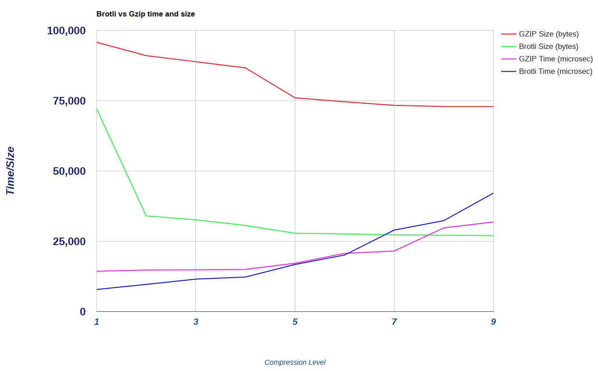

# Brotli Compare
Basic scripts to test any file comparing Gzip and Brotli across speed and compression strength.  Output is dumped to an HTML result and plotted with Google Charts.  It can be easily extended or changed to compare other compression engines.  Note that default Brotli compression level (MAX) is not tested as it skews the graph for time but it's worth considering manually.

## Usage
```
$ git clone 
$ ./compare.sh [test file]
```

For best results clone into /tmp or tmpfs to guarantee eliminating I/O time.
Beware that each run will delete the results from a previous run in pwd, so best to work in a new directory with copies of files.

## Viewing results
A local file will be generated called $INPUTFILE.results.html.  This may be viewed with a browser:

```
$ xdg-open *results.html
```

The charts plot two data units on the same graph which is a no-no but it's nice to view both on one.

## Example

